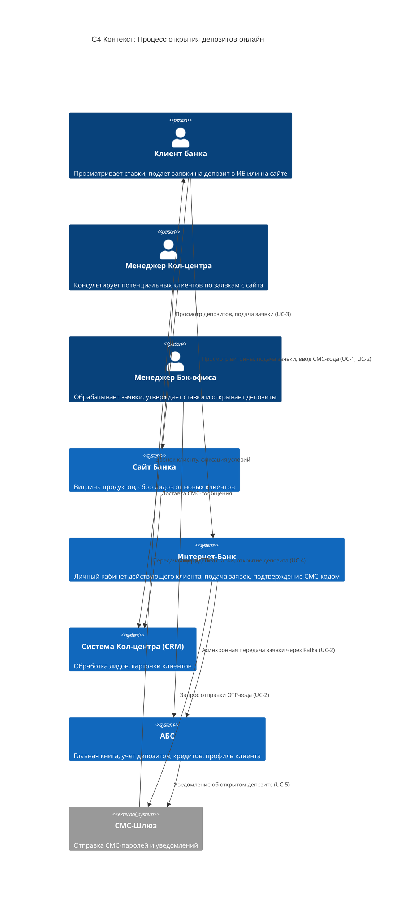
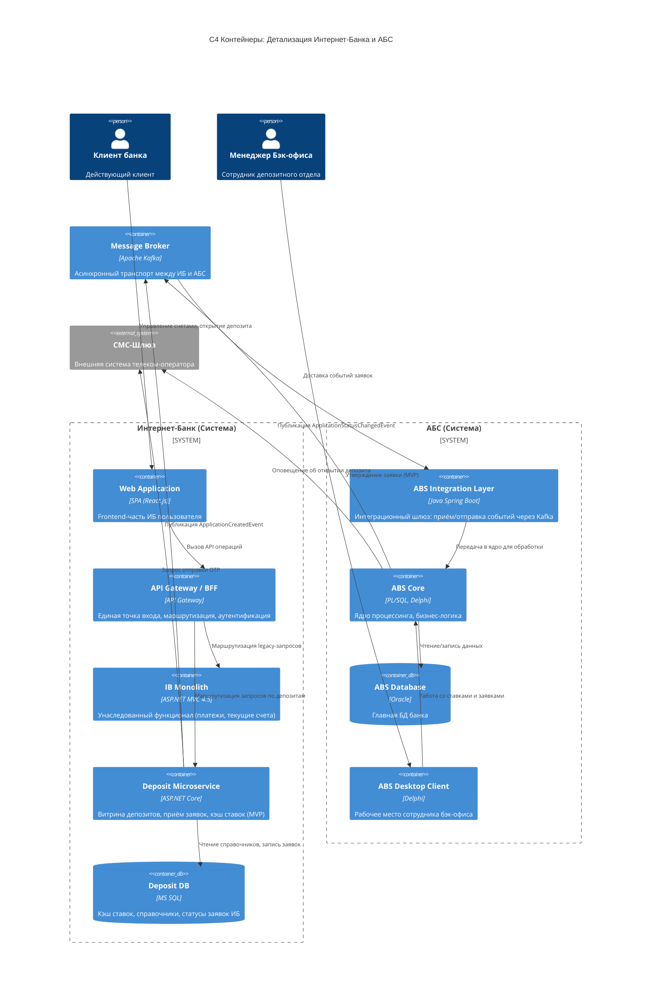
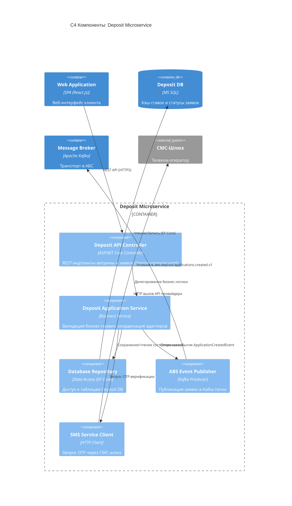

### **Название задачи:** Концептуальная архитектура открытия депозитов онлайн (MVP)
### **Автор:** Алексей Красников
### **Дата:** 2026-04-07

---

### **Функциональные требования**

Описание верхнеуровневых Use Cases для MVP открытия депозитов онлайн:

| **№** | **Действующие лица или системы**                               | **Use Case**                                | **Описание**                                                                                                                                                                                                                                                                                               |
| :---: | :------------------------------------------------------------- | :------------------------------------------ | :--------------------------------------------------------------------------------------------------------------------------------------------------------------------------------------------------------------------------------------------------------------------------------------------------------- |
| UC-1  | Клиент (действующий), Интернет-Банк, Deposit Service           | Просмотр витрины депозитов в ИБ             | Клиент авторизуется в ИБ и видит список доступных депозитов с актуальными ставками, включая персонализированные предложения на основе профиля клиента. Данные берутся из кэша Deposit Service (синхронизированного с АБС).                                                                                 |
| UC-2  | Клиент (действующий), Интернет-Банк, Deposit Service, СМС-шлюз | Подача заявки на депозит в ИБ               | Клиент выбирает продукт, указывает счёт списания и сумму, получает СМС-код (OTP) для подтверждения. После подтверждения заявка сохраняется в Deposit DB со статусом NEW и асинхронно передаётся в АБС через Kafka. Клиент получает подтверждение «Заявка принята».                                         |
| UC-3  | Клиент (новый), Сайт Банка, Система Кол-центра (CRM)           | Подача заявки на депозит через сайт         | Новый клиент на сайте видит витрину депозитов с актуальными ставками. Оставляет заявку (ФИО + телефон). Данные передаются в CRM кол-центра по HTTPS. Менеджер КЦ перезванивает клиенту, консультирует по условиям и может предложить особые условия. Для завершения — визит в отделение для идентификации. |
| UC-4  | Менеджер Бэк-офиса, АБС                                        | Обработка заявки менеджером бэк-офиса (MVP) | Менеджер бэк-офиса депозитов в десктопном клиенте АБС видит очередь онлайн-заявок. Рассчитывает/утверждает ставку (в MVP — с использованием модуля ставок АБС, заменившего Excel). После утверждения АБС публикует событие `ApplicationStatusChangedEvent` через Kafka.                                    |
| UC-5  | АБС, СМС-шлюз, Клиент                                          | Уведомление клиента об изменении статуса    | После утверждения ставки и/или открытия депозита АБС отправляет СМС-уведомление клиенту через СМС-шлюз. Deposit Service обновляет статус заявки в своей БД на основе события из Kafka.                                                                                                                     |

---

### **Нефункциональные требования**

Архитектурно-значимые требования, влияющие на решение:

| **№**  | **Требование**                                                                                                                                                         |
| :----: | :--------------------------------------------------------------------------------------------------------------------------------------------------------------------- |
| НФТ-1  | Доступность онлайн-сервисов 24/7 с SLA 99,9%. Переключение на резервный ЦОД при сбое основного.                                                                        |
| НФТ-2  | Отклик системы — миллисекунды. Текущая проблема: загрузка справочных данных >1 сек. Необходимо кэширование.                                                            |
| НФТ-3  | Исключение прямой синхронной работы ИБ с API/БД АБС. База АБС перегружена — прямой доступ недопустим.                                                                  |
| НФТ-4  | Асинхронное взаимодействие ИБ → АБС через Apache Kafka. Гарантия доставки (at-least-once), eventual consistency.                                                       |
| НФТ-5  | АБС масштабируется только вертикально (ограничение Oracle PL/SQL). Интернет-банк — горизонтально.                                                                      |
| НФТ-6  | Обязательное шифрование трафика (SSL/TLS) на сайте и в ИБ при передаче чувствительных данных.                                                                          |
| НФТ-7  | Функционал OTP (СМС-код) реализуется силами команды банка, без привлечения подрядчика ядра ИБ.                                                                         |
| НФТ-8  | Новые технологии должны быть совместимы с существующими платформами. Текущая платформа ИБ (.NET Framework 4.5) несовместима с Kafka → необходим отдельный микросервис. |
| НФТ-9  | Равномерное горизонтальное масштабирование и балансировка нагрузки между серверами и ЦОДами.                                                                           |
| НФТ-10 | Разработка документации для дальнейшего расширения системы. Версионирование API.                                                                                       |

---

### **Решение**

#### Ключевые архитектурные решения

**1. Выделение Deposit Service из монолита Интернет-банка**

Текущий ИБ — монолит на устаревшем ASP.NET MVC 4.5 / .NET Framework 4.5. Развитие нового функционала внутри монолита сопряжено с высоким Time-to-Market, зависимостью от подрядчика и невозможностью изолированного масштабирования. Кроме того, .NET Framework 4.5 несовместим с Apache Kafka (НФТ-8).

**Решение:** выделить независимый микросервис `Deposit Service` на ASP.NET Core. Это обеспечит:
- Независимый CI/CD и релизный цикл (in-house, без подрядчика)
- Совместимость с Kafka (через Confluent .NET Client)
- Возможность горизонтального автомасштабирования
- Маршрутизация через API Gateway: legacy-функционал → монолит, депозиты → Deposit Service

**2. Асинхронная интеграция с АБС через Kafka**

Прямая синхронная запись в АБС недопустима (НФТ-3, НФТ-5). Deposit Service публикует событие `ApplicationCreatedEvent` в Kafka-топик. Интеграционный слой АБС вычитывает события со своей скоростью, демпфируя пики нагрузки.

**Решение:** Event-Driven Architecture с Kafka как единым транспортом:
- Топик `abs.deposit.applications.created.v1` — новые заявки из ИБ → АБС
- Топик `abs.deposit.applications.status_changed.v1` — обратная связь АБС → ИБ (ставка утверждена / депозит открыт / отказ)
- Гарантия at-least-once delivery + идемпотентные обработчики

Контракты зафиксированы в спецификациях:
- REST API: `api/deposit-openapi.yaml`
- Async API: `api/abs-integration-asyncapi.yaml`
- Доменная модель: `domain/data-model.md`

---

#### Диаграмма контекста (C4 Level 1)

На диаграмме показаны все системы и участники процесса открытия депозитов онлайн.

---

#### Диаграмма контейнеров (C4 Level 2)

Детализация Интернет-банка и АБС — двух ключевых систем решения.

---

#### Диаграмма компонентов Deposit Microservice (C4 Level 3)

---

### **Альтернативы**

#### Альтернатива 1: Разработка внутри монолита ИБ (ASP.NET 4.5)

Реализация витрины депозитов и процессинга заявок непосредственно внутри существующего монолита.

- ✅ Не требует доработки инфраструктуры (API Gateway, SSO)
- ❌ Релиз привязан к подрядчику монолита — высокий Time-to-Market
- ❌ Невозможно изолированно масштабировать депозитный модуль
- ❌ .NET Framework 4.5 несовместим с Kafka — потребуется промежуточный адаптер

#### Альтернатива 2: Синхронная интеграция с АБС через REST API

Deposit Service напрямую вызывает REST API ядра АБС для создания заявок.

- ✅ Клиент получает мгновенный ответ о результате
- ❌ АБС жёстко зависит от нагрузки фронтенда (нет fault tolerance)
- ❌ База АБС уже перегружена — риск деградации всего банка

#### Альтернатива 3: Интеграция через буферные таблицы БД (Database Link)

Deposit Service пишет заявки в промежуточные таблицы, АБС их вычитывает.

- ✅ Простота реализации без новых инфраструктурных компонентов
- ❌ Антипаттерн Integration Database — высокая связность схем данных
- ❌ Сложность контроля доставки и мониторинга

---

### **Недостатки, ограничения, риски**

| **Категория**   | **Описание**                                                                                                                                               |
| :-------------- | :--------------------------------------------------------------------------------------------------------------------------------------------------------- |
| **Ограничение** | АБС масштабируется только вертикально. При росте нагрузки потребуется вертикальное масштабирование сервера Oracle DB.                                      |
| **Ограничение** | Текущая платформа ИБ (.NET Framework 4.5) несовместима с Kafka. Весь новый функционал должен быть реализован в отдельном микросервисе.                     |
| **Ограничение** | Функционал OTP реализуется без подрядчика ядра ИБ. Необходима собственная интеграция с СМС-шлюзом.                                                         |
| **Риск**        | Переход к eventual consistency: клиент видит статус «Заявка принята», но реальное открытие произойдёт позже. Необходим UX-индикатор ожидания.              |
| **Риск**        | Потеря сообщений в Kafka при сбоях — необходимы механизмы at-least-once delivery и идемпотентные обработчики на стороне АБС.                               |
| **Риск**        | Усложнение DevOps: появление API Gateway, микросервиса, Kafka-кластера значительно повышает операционную сложность. Потребуются мониторинг и алертинг.     |
| **Недостаток**  | При ручной обработке заявок бэк-офисом (MVP) задержка открытия депозита может составлять от 20 мин до нескольких часов. В целевом решении — автоматизация. |
| **Недостаток**  | Необходимо управление распределёнными сессиями/SSO между монолитом ИБ и новым микросервисом.                                                               |

---

### Приложения

Дополнительные артефакты к данному ADR:

- **REST API контракт:** [deposit-openapi.yaml](api/deposit-openapi.yaml)
- **Async API контракт (Kafka):** [abs-integration-asyncapi.yaml](api/abs-integration-asyncapi.yaml)
- **Доменная модель:** [data-model.md](domain/data-model.md)
- **Sequence-диаграмма:** [Sequence_Deposit_Creation.md](Sequence_Deposit_Creation.md)
