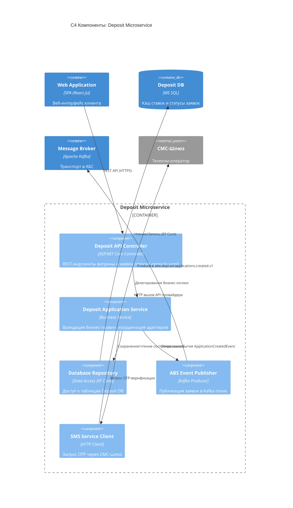

# C4 Component Diagram (Уровень Компонентов)

Детализация внутреннего устройства Deposit Microservice. Источник правды — [ADR_Deposit_Online.md](ADR_Deposit_Online.md).

```mermaid
C4Component
    title C4 Компоненты: Deposit Microservice

    Container_Boundary(dep_service, "Deposit Microservice") {
        Component(web_api, "Deposit API Controller", "ASP.NET Core Controller", "REST-эндпоинты витрины и заявок (deposit-openapi.yaml)")
        Component(domain_logic, "Deposit Application Service", "Business Service", "Валидация бизнес-правил, координация адаптеров")
        Component(db_adapter, "Database Repository", "Data Access (EF Core)", "Доступ к таблицам Deposit DB")
        Component(abs_adapter, "ABS Event Publisher", "Kafka Producer", "Публикация заявок в Kafka-топик")
        Component(sms_adapter, "SMS Service Client", "HTTP Client", "Запрос OTP через СМС-шлюз")
    }

    Container(spa, "Web Application", "SPA (React.js)", "Веб-интерфейс клиента")
    ContainerDb(dep_db, "Deposit DB", "MS SQL", "Кэш ставок и статусы заявок")
    Container(kafka, "Message Broker", "Apache Kafka", "Транспорт в АБС")
    System_Ext(sms, "СМС-Шлюз", "Телеком-оператор")

    Rel(spa, web_api, "REST API (HTTPS)")
    Rel(web_api, domain_logic, "Делегирование бизнес-логики")
    Rel(domain_logic, db_adapter, "Сохранение/чтение состояния заявки")
    Rel(domain_logic, abs_adapter, "Отправка события ApplicationCreatedEvent")
    Rel(domain_logic, sms_adapter, "Запрос OTP-верификации")

    Rel(db_adapter, dep_db, "Чтение/Запись (EF Core)")
    Rel(abs_adapter, kafka, "Produce в abs.deposit.applications.created.v1")
    Rel(sms_adapter, sms, "HTTP вызов API провайдера")
```
