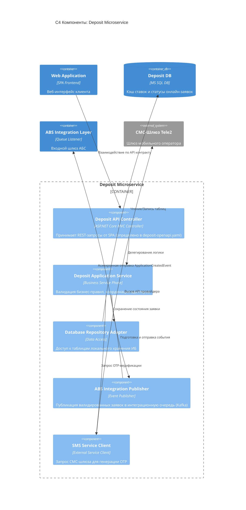

# C4 Component Diagram (Уровень Компонентов)

```mermaid
C4Component
    title C4 Компоненты: Deposit Microservice

    Container_Boundary(dep_service, "Deposit Microservice") {
        Component(web_api, "Deposit API Controller", "ASP.NET Core MVC Controller", "Принимает REST-запросы от SPA (определено в deposit-openapi.yaml)")
        Component(domain_logic, "Deposit Application Service", "Business Service Phase", "Валидация бизнес-правил, координация адаптеров")
        Component(db_adapter, "Database Repository Adapter", "Data Access", "Доступ к таблицам локального хранения ИБ")
        Component(abs_adapter, "ABS Integration Publisher", "Event Publisher", "Публикация валидированных заявок в интеграционную очередь (Kafka)")
        Component(sms_adapter, "SMS Service Client", "External Service Client", "Запрос СМС-шлюза для генерации OTP")
    }

    Container(spa, "Web Application", "SPA Frontend", "Веб-интерфейс клиента")
    ContainerDb(dep_db, "Deposit DB", "MS SQL DB", "Кэш ставок и статусы онлайн-заявок")
    Container(abs_api, "ABS Integration Layer", "Queue Listener", "Входной шлюз АБС")
    System_Ext(sms, "СМС-Шлюз Tele2", "Шлюз мобильного оператора")

    Rel(spa, web_api, "Взаимодействие по API контракту")
    Rel(web_api, domain_logic, "Делегирование логики")
    Rel(domain_logic, abs_adapter, "Подготовка и отправка события")
    Rel(domain_logic, db_adapter, "Сохранение состояния заявки")
    Rel(domain_logic, sms_adapter, "Запрос OTP-верификации")

    Rel(db_adapter, dep_db, "Чтение/Запись таблиц")
    Rel(abs_adapter, abs_api, "Асинхронная отправка ApplicationCreatedEvent")
    Rel(sms_adapter, sms, "Вызов API провайдера")
```
