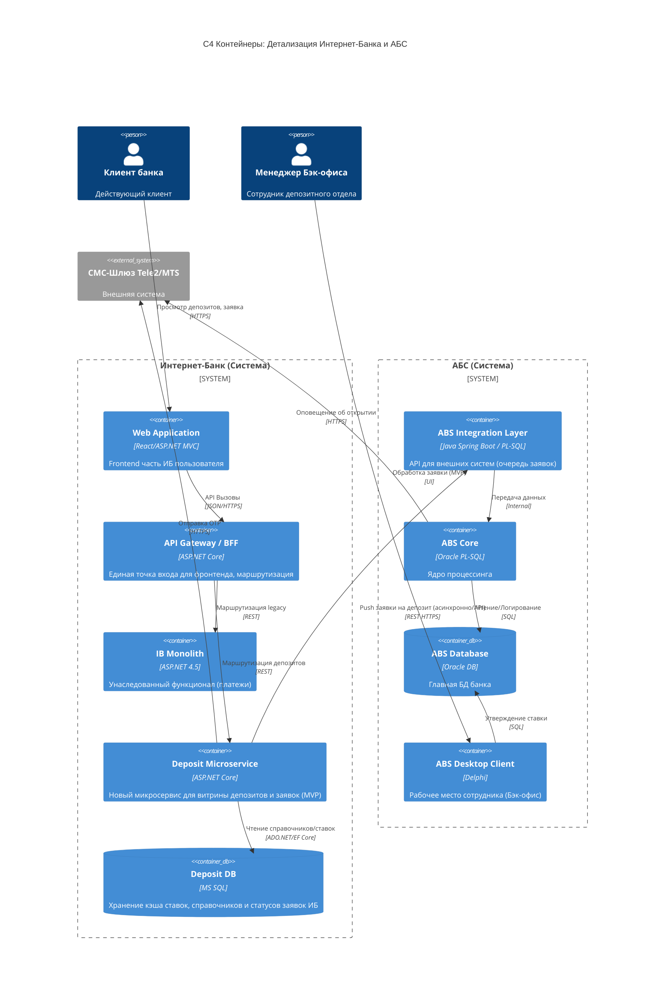

# C4 Container Diagram (Уровень Контейнеров)

```mermaid
C4Container
    title C4 Контейнеры: Детализация Интернет-Банка и АБС

    Person(client, "Клиент банка", "Действующий клиент")
    Person(managerBO, "Менеджер Бэк-офиса", "Сотрудник депозитного отдела")

    System_Boundary(ib, "Интернет-Банк (Система)") {
        Container(ib_spa, "Web Application", "React/ASP.NET MVC", "Frontend часть ИБ пользователя")
        Container(ib_api, "API Gateway / BFF", "ASP.NET Core", "Единая точка входа для фронтенда, маршрутизация")
        Container(ib_legacy, "IB Monolith", "ASP.NET 4.5", "Унаследованный функционал (платежи)")
        Container(dep_service, "Deposit Microservice", "ASP.NET Core", "Новый микросервис для витрины депозитов и заявок (MVP)")
        ContainerDb(dep_db, "Deposit DB", "MS SQL", "Хранение кэша ставок, справочников и статусов заявок ИБ")
    }

    System_Boundary(abs, "АБС (Система)") {
        Container(abs_api, "ABS Integration Layer", "Java Spring Boot / PL-SQL", "API для внешних систем (очередь заявок)")
        Container(abs_core, "ABS Core", "Oracle PL-SQL", "Ядро процессинга")
        ContainerDb(abs_db, "ABS Database", "Oracle DB", "Главная БД банка")
        Container(abs_client, "ABS Desktop Client", "Delphi", "Рабочее место сотрудника (Бэк-офис)")
    }

    System_Ext(sms, "СМС-Шлюз Tele2/MTS", "Внешняя система")

    %% Связи клиента и ИБ
    Rel(client, ib_spa, "Просмотр депозитов, заявка", "HTTPS")
    Rel(ib_spa, ib_api, "API Вызовы", "JSON/HTTPS")
    Rel(ib_api, ib_legacy, "Маршрутизация legacy", "REST")
    Rel(ib_api, dep_service, "Маршрутизация депозитов", "REST")
    
    %% Логика внутри ИБ
    Rel(dep_service, dep_db, "Чтение справочников/ставок", "ADO.NET/EF Core")
    
    %% Связи ИБ с внешним миром
    Rel(dep_service, abs_api, "Push заявки на депозит (асинхронно/API)", "REST HTTPS")
    Rel(dep_service, sms, "Отправка OTP", "HTTPS")
    
    %% Логика внутри АБС
    Rel(abs_api, abs_core, "Передача данных", "Internal")
    Rel(abs_core, abs_db, "Чтение/Логирование", "SQL")
    Rel(managerBO, abs_client, "Обработка заявки (MVP)", "UI")
    Rel(abs_client, abs_db, "Утверждение ставки", "SQL")
    Rel(abs_core, sms, "Оповещение об открытии", "HTTPS")
```
