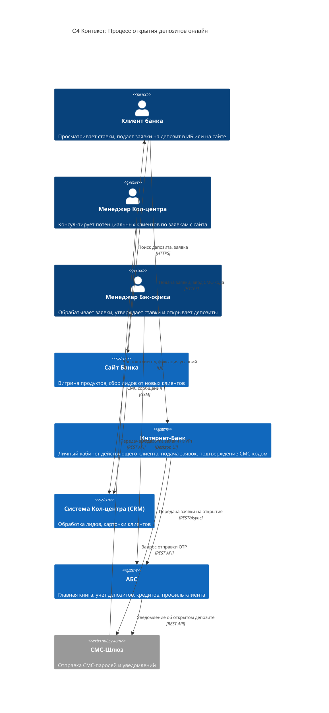

# C4 Context Diagram (Уровень Контекста)

```mermaid
C4Context
    title C4 Контекст: Процесс открытия депозитов онлайн

    Person(client, "Клиент банка", "Просматривает ставки, подает заявки на депозит в ИБ или на сайте")
    Person(managerCC, "Менеджер Кол-центра", "Консультирует потенциальных клиентов по заявкам с сайта")
    Person(managerBO, "Менеджер Бэк-офиса", "Обрабатывает заявки, утверждает ставки и открывает депозиты")

    System(site, "Сайт Банка", "Витрина продуктов, сбор лидов от новых клиентов")
    System(ib, "Интернет-Банк", "Личный кабинет действующего клиента, подача заявок, подтверждение СМС-кодом")
    System(cc, "Система Кол-центра (CRM)", "Обработка лидов, карточки клиентов")
    System(abs, "АБС", "Главная книга, учет депозитов, кредитов, профиль клиента")
    System_Ext(sms, "СМС-Шлюз", "Отправка СМС-паролей и уведомлений")

    Rel(client, site, "Поиск депозита, заявка", "HTTPS")
    Rel(client, ib, "Подача заявки, ввод СМС-кода", "HTTPS")
    Rel(site, cc, "Передача лида", "REST API")
    Rel(managerCC, cc, "Звонок клиенту, фиксация условий", "UI")
    
    Rel(ib, sms, "Запрос отправки OTP", "REST API")
    Rel(ib, abs, "Передача заявки на открытие", "REST/Async")
    
    Rel(managerBO, abs, "Обработка заявки (MVP)", "Desktop UI")
    Rel(abs, sms, "Уведомление об открытом депозите", "REST API")
    Rel(sms, client, "СМС сообщения", "GSM")
```
