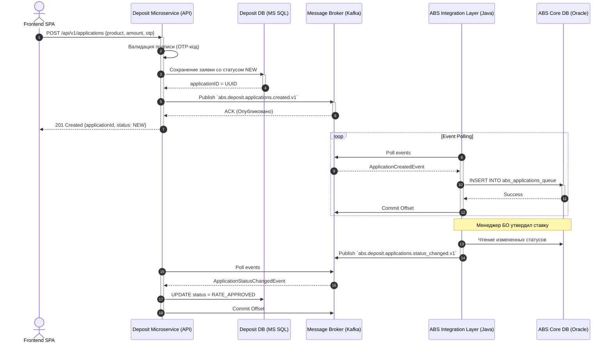

# UML Sequence Diagram: Технический процесс подачи заявки онлайн

В диаграмме описывается технический процесс прохождения заявки клиента от Интернет-Банка через Deposit Service в АБС. Показан сценарий асинхронного взаимодействия.

