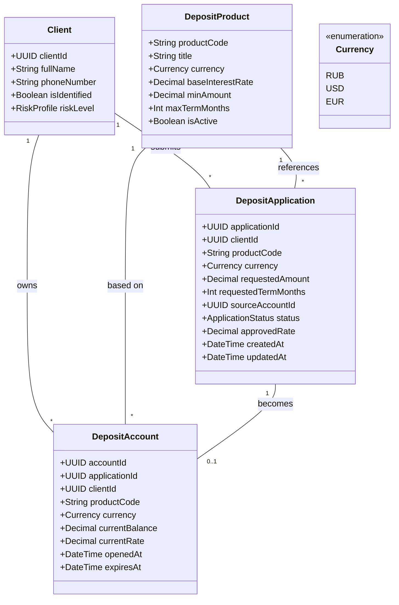

# Ревью доменной модели: разбор полей и критические улучшения

**Дата:** 2026-04-09
**Автор:** Алексей Красников
**Статус:** проектное ревью (предложения, не обязательные к применению)

---

## 1. Назначение документа

Документ разбирает текущую версию доменной модели из [data-model.md](data-model.md) — объясняет назначение каждого поля, фиксирует несогласованности с контрактами [deposit-openapi.yaml](../api/deposit-openapi.yaml) и [abs-integration-asyncapi.yaml](../api/abs-integration-asyncapi.yaml) и предлагает минимальный набор критических улучшений.

Связь с остальными артефактами Task 3:
- **ADR:** [ADR_Deposit_Online.md](../ADR_Deposit_Online.md) — Use Cases UC-1…UC-5 и НФТ-1…НФТ-10, на которые ссылается разбор.
- **Источник модели:** [data-model.md](data-model.md) — утверждённая MVP-версия. В рамках этого ревью **не изменяется**; все предложения собраны отдельно.

Текущая модель покрывает базовый сценарий «витрина → заявка → счёт», но не содержит нескольких критических для банка полей (валюта, срок заявки, счёт списания, трассировка «заявка → счёт»). Ниже — разбор и 8 предложений по устранению этих пробелов.

---

## 2. Разбор текущей модели

### 2.1 Client — клиент банка

| Поле | Тип | Смысл | Связь |
|---|---|---|---|
| `clientId` | String | Внутренний ID клиента в системах банка (действующего — из АБС; потенциального — из CRM) | UC-1, UC-2; FK в `DepositApplication`, `DepositAccount` |
| `fullName` | String | ФИО одной строкой. MVP-упрощение — в продуктиве обычно разбивается на `lastName` / `firstName` / `middleName` для интеграции с АБС и ЕСИА | UC-3 (сбор лида на сайте) |
| `phoneNumber` | String | Номер телефона для OTP-верификации и обратной связи | UC-2 (СМС-код), UC-3 (перезвон КЦ), UC-5 (уведомления) |
| `isIdentified` | Boolean | Флаг «пройдена ли полная идентификация клиента». Новый клиент из UC-3 (заявка с сайта) — `false`, требуется визит в отделение | UC-3 |
| `riskLevel` | RiskProfile | Кредитный риск-профиль `LOW/MEDIUM/HIGH` для согласования спец-ставок бэк-офисом | UC-4 (менеджер БО принимает решение о ставке) |

### 2.2 DepositProduct — карточка депозитного продукта

| Поле | Тип | Смысл | Связь |
|---|---|---|---|
| `productCode` | String | Уникальный код продукта, пример из OpenAPI: `DEP-STANDART-01`. Используется как FK в заявках и счетах | UC-1, UC-3 |
| `title` | String | Отображаемое название продукта в витрине ИБ и на сайте | UC-1 |
| `baseInterestRate` | Decimal | Базовая годовая ставка, % (база, поверх которой БО может утвердить индивидуальную ставку) | UC-1, UC-4 |
| `minAmount` | Decimal | Минимальная сумма вклада для валидации формы | UC-2 |
| `maxTermMonths` | Int | Максимальный допустимый срок продукта (мес.) | UC-2 |
| `isActive` | Boolean | Показывать ли продукт в витрине в данный момент. Снятый с продажи продукт сохраняется исторически, но не отображается | UC-1 |

### 2.3 DepositApplication — заявка на открытие депозита

| Поле | Тип | Смысл | Связь |
|---|---|---|---|
| `applicationId` | String (в OpenAPI — UUID) | PK заявки, используется как correlation-id между ИБ, Kafka и АБС | UC-2, UC-4, UC-5 |
| `clientId` | String | FK на `Client` | UC-2 |
| `productCode` | String | FK на `DepositProduct` | UC-2 |
| `requestedAmount` | Decimal | Запрашиваемая клиентом сумма вклада | UC-2 |
| `status` | ApplicationStatus | Статус жизненного цикла заявки: `NEW → PENDING_BACKOFFICE → RATE_APPROVED → OPENED` (или `REJECTED`) | UC-2, UC-4, UC-5 |
| `approvedRate` | Decimal | Ставка, утверждённая менеджером бэк-офиса. Может отличаться от `baseInterestRate` (спец-условия по риск-профилю) | UC-4 |
| `createdAt` | DateTime | Момент подачи заявки клиентом | UC-2 |
| `updatedAt` | DateTime | Момент последнего изменения статуса (например, после `ApplicationStatusChangedEvent` из АБС) | UC-4, UC-5 |

### 2.4 DepositAccount — открытый депозитный счёт

| Поле | Тип | Смысл | Связь |
|---|---|---|---|
| `accountId` | String | PK счёта в системе учёта | UC-5 |
| `clientId` | String | FK на `Client` | UC-5 |
| `productCode` | String | FK на `DepositProduct` — с какого продукта открыт счёт | — |
| `currentBalance` | Decimal | Текущий остаток на счёте (меняется при капитализации и пополнении) | — |
| `currentRate` | Decimal | Ставка, применяемая к этому конкретному счёту. Может отличаться от базовой — фиксируется в момент открытия | — |
| `openedAt` | DateTime | Дата и время открытия счёта | UC-5 |
| `expiresAt` | DateTime | Дата окончания срока вклада | — |

---

## 3. Несогласованности с контрактами OpenAPI / AsyncAPI

При сверке `data-model.md` с API-контрактами обнаружено 5 расхождений:

### 3.1 `DepositApplication` response в OpenAPI неполный
В [deposit-openapi.yaml](../api/deposit-openapi.yaml) схема ответа `DepositApplication` содержит только: `applicationId`, `clientId`, `productCode`, `requestedAmount`, `status`, `createdAt`.

Отсутствуют поля `approvedRate` и `updatedAt`, которые есть в domain и фигурируют в AsyncAPI `StatusChangePayload`. Следствие: клиент ИБ не сможет прочитать актуальную утверждённую ставку через REST — разрыв при реализации UC-4 → UC-5 на UI.

### 3.2 `ApplicationPayload` в AsyncAPI не содержит `status`
В [abs-integration-asyncapi.yaml](../api/abs-integration-asyncapi.yaml) сообщение `ApplicationCreatedEvent` не содержит поле `status`. Неявно подразумевается `NEW`, но это не зафиксировано в контракте — consumer в ABS Integration Layer вынужден догадываться.

### 3.3 `otpCode` живёт только в запросе
В `ApplicationCreateRequest` поле `otpCode` есть, но в доменной модели (ни в `DepositApplication`, ни в `Client`) нет ни самого кода, ни таймстемпа верификации. Факт OTP-верификации не сохраняется — теряется аудит, который банк обязан вести.

### 3.4 Типизация идентификаторов не унифицирована
В `data-model.md` все `*Id` — просто `String`. В `deposit-openapi.yaml` те же поля имеют `format: uuid`. Формальный разрыв контракта: domain допускает любую строку, API требует UUID.

### 3.5 Нет валюты ни в одной сущности
Ни `DepositProduct`, ни `DepositApplication`, ни `DepositAccount` не имеют поля `currency`. Для банка, у которого есть рублёвые и валютные вклады, это критическое упущение — продукт «12.5% годовых» без валюты неоднозначен.

---

## 4. Критические улучшения (8 правок)

Минимальный набор, устраняющий пункты 3.1–3.5 и главные логические пробелы UC-2:

| # | Сущность | Поле / изменение | Тип | Обоснование |
|---|---|---|---|---|
| 1 | `DepositProduct` | добавить `currency` | `Currency` (ISO 4217 enum) | Без валюты продукт неоднозначен. Устраняет разрыв 3.5. |
| 2 | `DepositApplication` | добавить `currency` | `Currency` | Фиксируется на момент подачи (продукт в разные периоды может быть в разной валюте). Устраняет разрыв 3.5. |
| 3 | `DepositAccount` | добавить `currency` | `Currency` | Нужно для регуляторной отчётности и бухучёта. Устраняет разрыв 3.5. |
| 4 | `DepositApplication` | добавить `requestedTermMonths` | `Int` | UC-2 предполагает, что клиент выбирает срок вклада — поля в модели нет вовсе, что логически невозможно. |
| 5 | `DepositApplication` | добавить `sourceAccountId` | `String (UUID)` | UC-2 прямо говорит: «клиент указывает счёт списания». Сейчас это не отражено. |
| 6 | `DepositAccount` | добавить `applicationId` | `String (UUID)` | FK-трассировка «заявка → счёт». Без неё невозможна отчётность «из какой заявки открыт счёт» и аудит УК-5. |
| 7 | Все сущности | унифицировать все `*Id` к типу `UUID` | `UUID` | Устраняет разрыв 3.4 — контракты OpenAPI уже ожидают `format: uuid`. |
| 8 | [deposit-openapi.yaml](../api/deposit-openapi.yaml) (рекомендация к контракту, не к domain) | добавить `approvedRate` и `updatedAt` в response-схему `DepositApplication` | — | Устраняет разрыв 3.1. Сам YAML в рамках этого ревью не меняется — рекомендация к следующему шагу. |

**Дополнительно к правкам 1–3:** ввести enum `Currency` в бизнес-глоссарий со значениями `RUB`, `USD`, `EUR` (ISO 4217).

---

## 5. Предлагаемая модель

Диаграмма отражает текущую модель с добавленными критическими полями (правки 1–7 из секции 4). Это **не** утверждённая версия — источником правды остаётся [data-model.md](data-model.md); данная диаграмма — предложение для следующей итерации.

---

## 6. Что осталось за скоупом

Следующие улучшения обсуждались, но в текущий ревью-цикл не включены — потребуют отдельной итерации:

- Разбор `Client.fullName` на `lastName` / `firstName` / `middleName` + `birthDate` + `email`.
- Сегментация клиентов (`clientSegment: STANDARD / PREMIUM / VIP`) для персонализированных предложений в UC-1.
- Расширение `DepositProduct`: `minTermMonths`, `maxAmount`, `capitalizationType`, `allowReplenishment`, `allowPartialWithdrawal`, `validFrom` / `validTo` (версионирование ставок).
- Аудит в `DepositApplication`: `assignedManagerId`, `rejectionReason`, `otpVerifiedAt`, `createdBy`, `updatedBy`, `version` (optimistic lock).
- `idempotencyKey` в `DepositApplication` для at-least-once delivery Kafka (НФТ-4).
- Расширение `DepositAccount`: `accountNumber` (20-значный банковский номер), `principalAmount`, `accruedInterest`, `status` (`ACTIVE/MATURED/CLOSED_EARLY/BLOCKED`), `closedAt`.
- Новые глоссарии: `IdentificationLevel`, `SourceChannel`, `CapitalizationType`, `AccountStatus`, `ClientSegment`.

Эти пункты — реалистичные требования к продуктивной доменной модели, но для MVP-скоупа Task 3 они избыточны.
