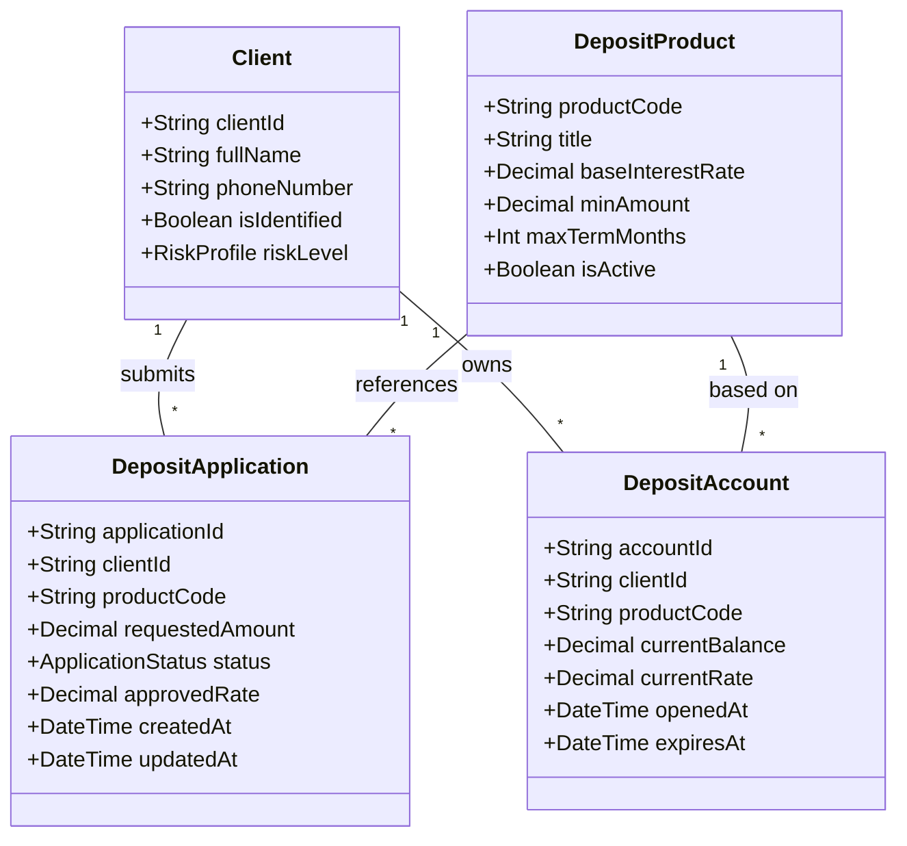

# Domain Data Model

Бизнес-модель описывает структуру ключевых сущностей предметной области "Депозиты", которые будут использоваться в контрактах (OpenAPI / AsyncAPI), БД микросервиса и АБС.

## Бизнес-глоссарий (Словари)

**ApplicationStatus** (Статус заявки):
- `NEW` — Создана клиентом в ИБ / на сайте.
- `PENDING_BACKOFFICE` — Ожидает ручной обработки менеджером БО.
- `RATE_APPROVED` — Бэк-офис согласовал ставку.
- `OPENED` — Депозит успешно открыт в АБС.
- `REJECTED` — Отклонена менеджером или АБС.

**RiskProfile** (Профиль кредитного риска для согласования спец-ставок):
- `LOW`
- `MEDIUM`
- `HIGH`
