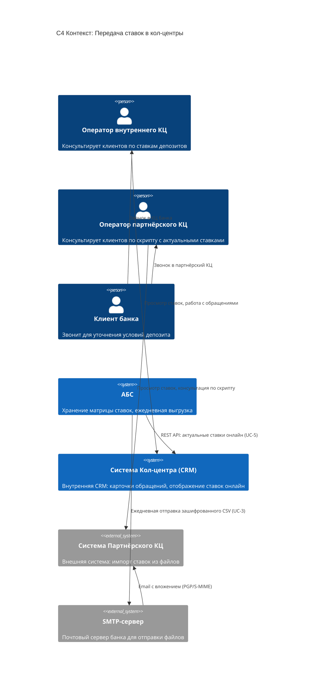
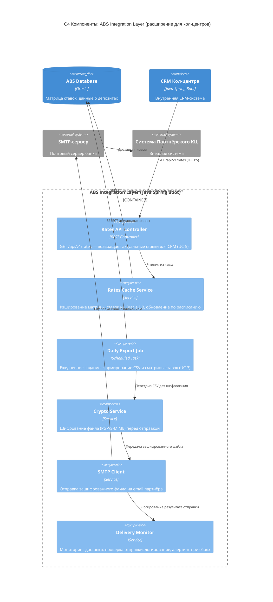

### **Название задачи:** Передача ставок по депозитам в кол-центры (внутренний и партнёрский)
### **Автор:** Алексей Красников
### **Дата:** 2026-04-07

---

### **Функциональные требования**

Верхнеуровневые Use Cases для обеспечения кол-центров актуальными ставками:

| **№** | **Действующие лица или системы** | **Use Case** | **Описание** |
| :-: | :- | :- | :- |
| UC-1 | Клиент, Оператор внутреннего КЦ, CRM, АБС | Консультация клиента по ставкам (внутренний КЦ) | Клиент звонит в кол-центр банка для уточнения условий депозита. Оператор открывает карточку обращения в CRM. CRM отображает актуальные ставки, полученные онлайн из модуля ставок АБС. Оператор консультирует клиента и при необходимости оформляет обращение. |
| UC-2 | Клиент, Оператор партнёрского КЦ, Система Партнёра | Консультация клиента по ставкам (партнёрский КЦ) | Клиент звонит на линию партнёрского кол-центра. Оператор работает в своей внутренней системе. Актуальные ставки загружены из CSV-файла, полученного от банка по email. Оператор видит ставки в интерфейсе и консультирует по скрипту. |
| UC-3 | АБС (PL/SQL Job), ABS Integration Layer (Java), SMTP-сервер | Автоматическая ежедневная выгрузка ставок для партнёра | Каждый день в заданное время PL/SQL-задание в АБС формирует CSV-файл с актуальными ставками. ABS Integration Layer забирает файл, шифрует его (PGP/S-MIME) и отправляет на email партнёрского КЦ через SMTP. |
| UC-4 | Система Партнёрского КЦ | Автоматический импорт ставок у партнёра | Система партнёрского КЦ обнаруживает зашифрованное письмо в почтовом ящике, расшифровывает вложение, парсит CSV и загружает ставки во внутреннюю БД для отображения операторам. |
| UC-5 | ABS Integration Layer, CRM Кол-центра | Онлайн-синхронизация ставок для внутреннего КЦ | CRM-система внутреннего КЦ получает актуальные ставки через REST API от ABS Integration Layer. Данные кэшируются на стороне CRM и обновляются по расписанию (polling) или по событию (push через Kafka). |

---

### **Нефункциональные требования**

| **№** | **Требование** |
| :-: | :- |
| НФТ-1 | Партнёрский КЦ — внешняя система. Нет возможности API-интеграции. Единственный доступный канал — получение файлов (email, SFTP недоступен). |
| НФТ-2 | Данные о ставках являются конфиденциальной информацией банка. При передаче внешнему партнёру обязательно шифрование (PGP или S/MIME). |
| НФТ-3 | Актуальность ставок: для внутреннего КЦ — обновление в реальном времени или near-real-time. Для партнёрского КЦ — допустима задержка до 24 часов (пакетная интеграция). |
| НФТ-4 | Мониторинг доставки файлов партнёру. Необходим механизм оповещения при сбое отправки или непрочтении письма. |
| НФТ-5 | При маркетинговой кампании ожидается значительный рост звонков. Партнёрский КЦ (100 операторов) должен быть подготовлен с актуальными данными заранее. |
| НФТ-6 | Решение должно базироваться на текущем процессе работы со ставками: ставки ведутся в модуле АБС (перенесены из Excel в рамках ADR Task 3). |
| НФТ-7 | CRM кол-центра (Java Spring Boot, микросервисная архитектура) поддерживает расширение — может интегрироваться с внешними API. |

---

### **Решение**

Задача разбивается на две подзадачи с разными паттернами интеграции:

#### Подзадача A: Внутренний кол-центр (CRM → АБС)

CRM-система внутреннего КЦ — это Java Spring Boot микросервисная платформа, развёрнутая в инфраструктуре банка. Она поддерживает расширение и API-интеграции.

**Решение:** ABS Integration Layer (Java Spring Boot) предоставляет REST API для получения актуальных ставок. CRM-система обращается к этому API для получения данных. Кэширование на стороне CRM обеспечивает отклик в миллисекунды при консультировании клиента.

#### Подзадача B: Партнёрский кол-центр (Файловый обмен)

Система партнёрского КЦ — внешняя, без API-интеграции, без SFTP. Единственный канал — приём файлов.

**Решение:** Автоматическая пакетная интеграция через защищённую электронную почту:
1. PL/SQL-задание в АБС ежедневно формирует CSV с актуальными ставками
2. ABS Integration Layer (Java) забирает файл, шифрует PGP/S-MIME
3. Отправляет зашифрованное вложение на почту партнёра через SMTP
4. На стороне партнёра — автоматический парсер расшифровывает и загружает данные

---

#### Диаграмма контекста (C4 Level 1) — Кейс передачи ставок в КЦ

---

#### Диаграмма компонентов ABS Integration Layer (C4 Level 3) — Кейс передачи ставок

---

### **Альтернативы**

#### Альтернатива 1: Ручная отправка файла ставок сотрудниками Бэк-офиса

Сотрудник бэк-офиса ежедневно вручную выгружает ставки из АБС и отправляет файл на email куратора в партнёрский КЦ.

- ✅ Нулевая стоимость разработки
- ❌ Высокий риск человеческой ошибки (забыли отправить, отправили не тот файл)
- ❌ Рутинная ежедневная нагрузка на бизнес-сотрудников

#### Альтернатива 2: B2B Веб-портал банка

Разработка веб-портала с авторизацией, где представитель партнёрского КЦ заходит и скачивает актуальные ставки.

- ✅ Высокая безопасность и полный контроль скачивания
- ✅ Возможность near-real-time обновления
- ❌ Требуется дорогостоящая разработка портала авторизации
- ❌ Зависимость от действий партнёра (может забыть зайти)

#### Альтернатива 3: Интеграция внутреннего КЦ через Database Link (прямой доступ к БД АБС)

CRM напрямую читает ставки из Oracle DB АБС.

- ✅ Простота реализации
- ❌ Антипаттерн Integration Database — высокая связность
- ❌ Дополнительная нагрузка на перегруженную БД АБС (противоречит НФТ из ADR Task 3)

---

### **Недостатки, ограничения, риски**

| **Категория** | **Описание** |
| :- | :- |
| **Ограничение** | Партнёрский КЦ не поддерживает API/SFTP — доступен только email. Это ограничивает оперативность обновления ставок. |
| **Ограничение** | Частота обновления для партнёра — не чаще 1 раза в сутки (пакетная интеграция). Внутри дня ставки у партнёра могут быть неактуальны. |
| **Риск** | Письма с файлами могут попадать в спам-фильтры почтового сервера партнёра. Необходим мониторинг доставки и резервный канал связи. |
| **Риск** | Компрометация PGP/S-MIME ключей — утечка конфиденциальных данных о ставках. Необходима ротация ключей. |
| **Риск** | При росте числа звонков в период маркетинговой кампании партнёрский КЦ может не справиться с нагрузкой, если ставки не были загружены вовремя. |
| **Недостаток** | Сотрудники внутреннего КЦ видят ставки, но не могут оформить заявку на депозит напрямую из CRM (в MVP — только консультация). |
| **Недостаток** | Для ABS Integration Layer потребуется доработка: новый REST API для ставок, генерация CSV, интеграция с SMTP и шифрование. Это увеличивает scope работ по АБС. |
