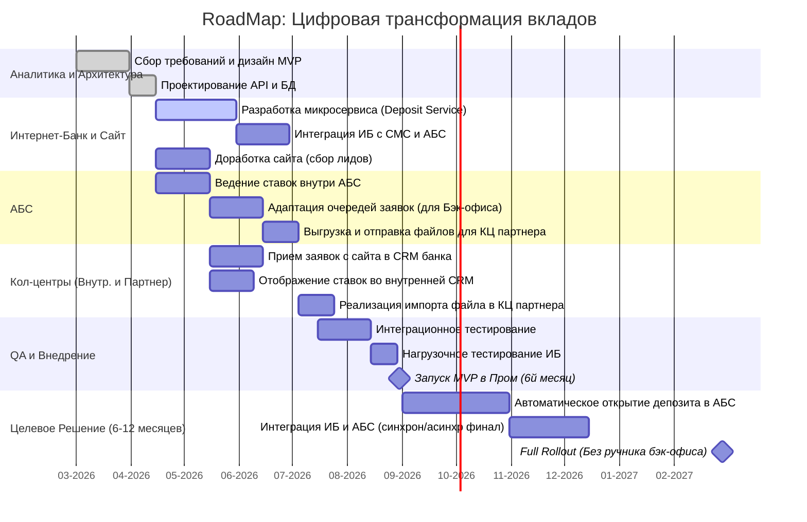

# RoadMap проекта (Горизонт: 6 месяцев MVP + 1 год ЦР)

```mermaid
gantt
    title RoadMap: Цифровая трансформация вкладов
    dateFormat  YYYY-MM-DD
    axisFormat  %m-%Y
    
    section Аналитика и Архитектура
    Сбор требований и дизайн MVP      :done, a1, 2026-03-01, 30d
    Проектирование API и БД            :done, a2, after a1, 15d

    section Интернет-Банк и Сайт
    Разработка микросервиса (Deposit Service) :active, ib1, after a2, 45d
    Интеграция ИБ с СМС и АБС                 :ib2, after ib1, 30d
    Доработка сайта (сбор лидов)              :ib3, after a2, 30d

    section АБС
    Ведение ставок внутри АБС                 :abs1, after a2, 30d
    Адаптация очередей заявок (для Бэк-офиса) :abs2, after abs1, 30d
    Выгрузка и отправка файлов для КЦ партнера:abs3, after abs2, 20d

    section Кол-центры (Внутр. и Партнер)
    Прием заявок с сайта в CRM банка          :cc1, after ib3, 30d
    Отображение ставок во внутренней CRM      :cc2, after abs1, 25d
    Реализация импорта файла в КЦ партнера    :cc3, after abs3, 20d

    section QA и Внедрение
    Интеграционное тестирование               :qa1, 2026-07-15, 30d
    Нагрузочное тестирование ИБ               :qa2, after qa1, 15d
    Запуск MVP в Пром (6й месяц)              :milestone, m1, 2026-08-30, 0d
    
    section Целевое Решение (6-12 месяцев)
    Автоматическое открытие депозита в АБС    :cr1, 2026-09-01, 60d
    Интеграция ИБ и АБС (синхрон/асинхр финал):cr2, after cr1, 45d
    Full Rollout (Без ручника бэк-офиса)      :milestone, m2, 2027-02-28, 0d
```
